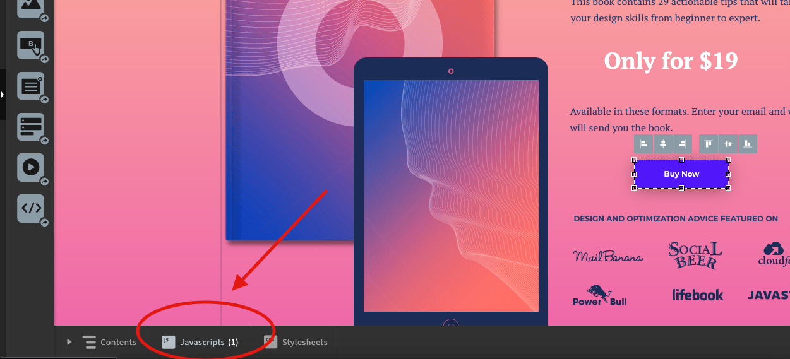
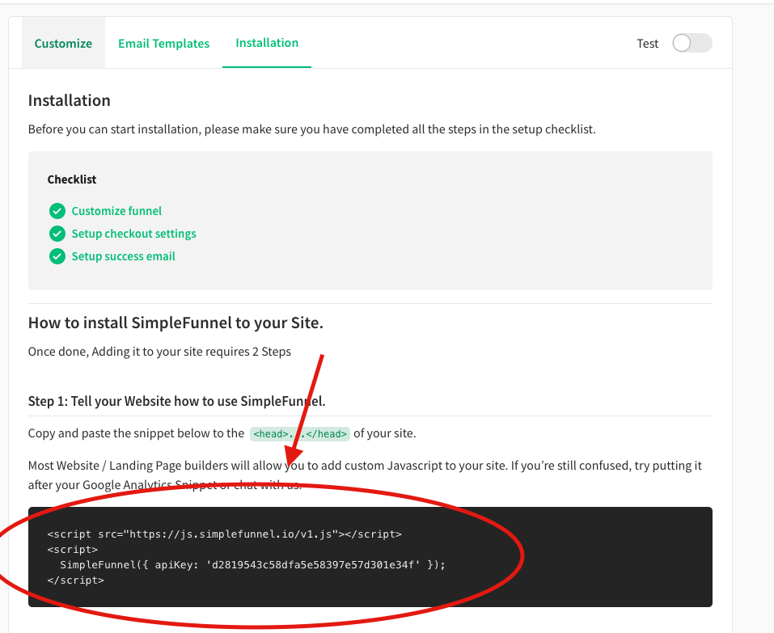
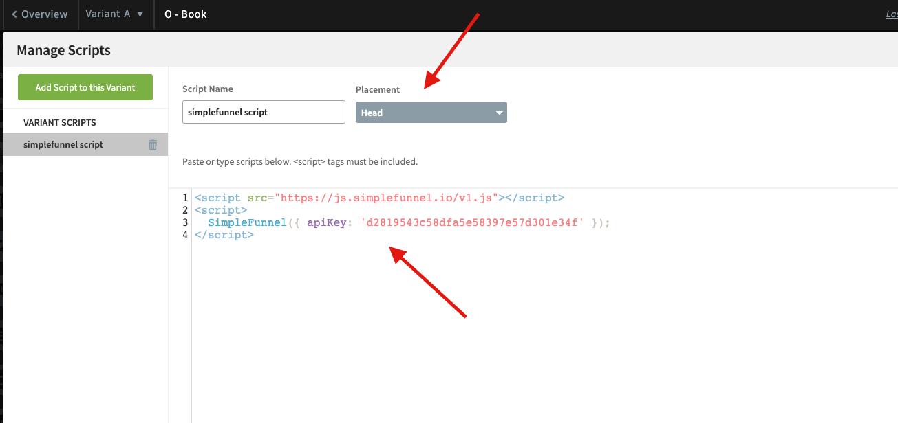
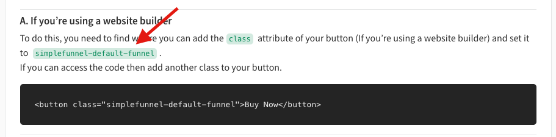
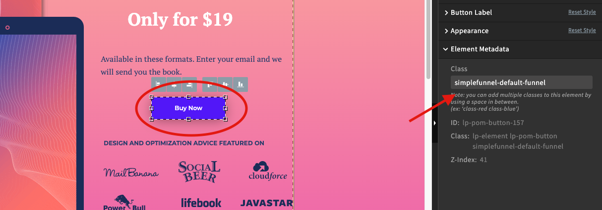
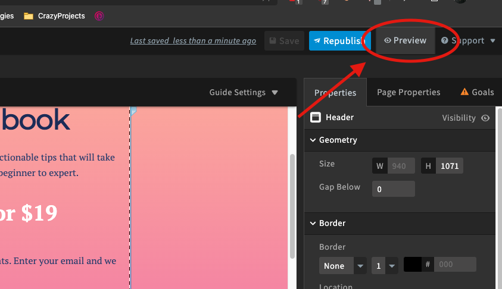
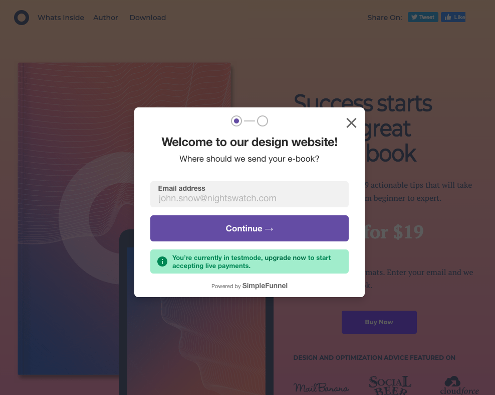

## Welcome to SimpleFunnel Unbounce Installation Guide

If you want to add a checkout flow and collect payments on your Unbounce site, this tutorial will help you achieve that.

This article assumes that you have already set up your account by completing all the necessary steps on your dashboard. If not, go to [The SimpleFunnel Website](https://simplefunnel.io) and setup your account.

Alternatively you can take a look at the [Video Tutorial here](https://www.youtube.com/watch?v=r3Xi4U6anJs&feature=emb_title)

### Step 1: Add SimpleFunnel Snippet to the page
---

Unbounce allows you to add custom code and scripts that are applied to your entire site or to individual pages in your site. This can be useful for adding additional HTML, CSS, Javascript and more.

On your page settings,

1. Add a custom Javascript to your Unbounce landing page,
2. Then paste the snippet given on the SimpleFunnel website inside the custom code element like shown below. ( make sure it's in the head )

### Step 2: Add a button and update the classname.
---

The next thing we want to do is add the button you want to use with SimpleFunnel and update it's classname.

1. Add the button element Button.
2. Click on the button.
3. Add the classname for your funnel in the funnel installation instructions to your button on the right hand panel.

Step 3: Publish!
That's it you're all ready to go. Just publish your site and your funnel should work as expected.

