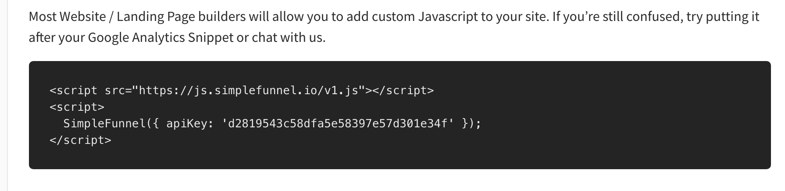
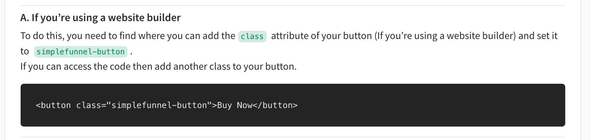

## Welcome to SimpleFunnel Webflow Installation Guide

If you want to add a checkout flow and collect payments on your Webflow site, this tutorial will help you achieve that.

This article assumes that you have already set up your account by completing all the necessary steps on your dashboard. If not, go to simplefunnel.io and setup your account.

### Step 1: Add SimpleFunnel Snippet to the page
Webflow allows you to add custom code and scripts that are applied to your entire site or to individual pages in your site. This can be useful for adding additional HTML, CSS, Javascript and more.

On your page settings,

1. Add a custom code element to your Webflow page,
2. Then paste the snippet given on the SimpleFunnel website inside the custom code element like shown below.

SimpleFunnel Funnel Installation Tab.

Click on Add Element > Code Snippet like shown below.

### Step 2: Add a button and update the classname.
The next thing we want to do is add the button you want to use with SimpleFunnel and update it's classname.

Click on Add Element > Button.
Right click on the button > Add Class.
Add the classname for your funnel in the funnel installation instructions.

### Step 3: Publish!
That's it you're all ready to go. Just publish your site and your funnel should work as expected.

